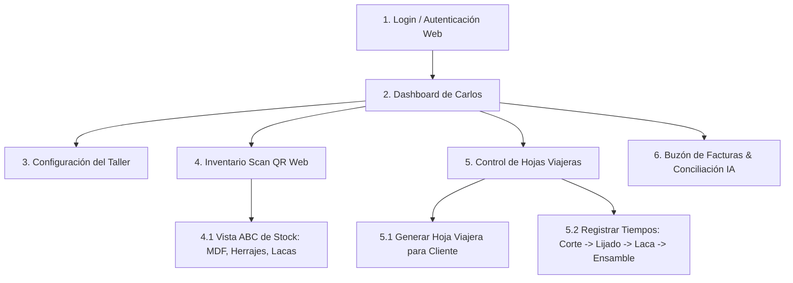

# Product Requirements Document (PRD): Termite v1.6 (MVP)

Este documento detalla las especificaciones de negocio y requerimientos funcionales para **Termite**, el SaaS vertical de control operativo y financiero diseñado para carpinterías, adaptado específicamente con base en los procesos y datos reales de **Carpintería Escobar** (Zapopan, Jalisco).

---

## 1. Contexto & Problema (El "Por Qué")
**Carlos** (dueño de Carpintería Escobar) gestiona un equipo de 14 personas (carpinteros, laqueadores, auxiliares, operador de CNC, chofer y administrativo). 
El taller sufre de ineficiencias críticas:
-   Desperdicio y daño de materia prima (tableros de MDF de 15mm/6mm, maderas) estimado en un **10% de merma** por mal almacenamiento.
-   Tiempos muertos buscando herramientas e insumos.
-   Pago de horas extras (hasta 25% extra semanal) por retrabajo de piezas dañadas.
-   Falta de control en la rentabilidad real de los proyectos (muebles como el *Mueble Pink Up*, *Exhibidor de lentes* y *Estructura SkinCare*).

---

## 2. Visión del Producto: Evolución de Versiones

### Fase 1: MVP (Solo para Carlos - Web Responsiva)
El objetivo del MVP es que **únicamente Carlos** tenga el control de su taller desde una aplicación web responsiva (optimizada para móviles). Carlos registrará las cotizaciones, dará seguimiento a las órdenes y controlará el inventario escaneando entradas/salidas con la cámara de su teléfono desde el navegador web.

### Fase 2: Ecosistema Completo (Trabajadores y Clientes - Web Multi-Rol)
-   **Portal del Trabajador:** Interfaz web ultra-simple para los carpinteros y laqueadores en el taller. 
    -   Cada estante o contenedor de material (ej. caja de bisagras o rack de MDF) tendrá un código QR físico.
    -   El trabajador lo escanea con la cámara de su celular y presiona un botón gigante de **"Falta Material"**.
    -   Carlos recibe una alerta inmediata en su panel para solicitar compras.
-   **Portal del Cliente Final:** Cotizador y catálogo web.
    -   El cliente cotiza y compra modelos y medidas estándar directo en la web.
    -   Si requiere una medida personalizada, llena un formulario de dimensiones básicas (**Alto x Ancho x Profundidad**).
    -   El sistema envía este formulario a Carlos como una **"Hoja Viajera Pendiente"** para que él calcule el costo real y envíe la cotización manual.

---

## 3. Requerimientos de Arquitectura de Backend (Monolito Laravel)

Para maximizar la velocidad de desarrollo y aprovechando que Gael domina el entorno, Termite se construirá como un **Monolito en Laravel (PHP) con base de datos PostgreSQL**:
-   **Base de datos:** PostgreSQL (alojada en Supabase o servicio administrado).
-   **Autenticación y Roles:** Gestionado directamente en el backend de Laravel (ej. usando `Laravel Breeze` o `Jetstream`) mediante un campo `role` en la tabla `users` (`admin`, `worker`, `client`).
-   **Políticas de Acceso:** Controladas en el backend a través de Middlewares y Policies de Laravel para asegurar que solo los usuarios administradores accedan a la información financiera, de facturas y costos fijos.

---

## 4. Requerimientos Funcionales del MVP (Fase 1)

### F1: Módulo de Finanzas y Configuración de Costos
-   **Preconfiguración de Mano de Obra:** El sistema vendrá precargado con los sueldos reales por hora de Carpintería Escobar:
    -   *Carpintero:* $88 MXN/hr
    -   *Laqueador:* $77 MXN/hr
    -   *Operador CNC:* $66 MXN/hr
    -   *Auxiliar Carpintero:* $48 MXN/hr
    -   *Auxiliar Laqueador / Chofer:* $45 MXN/hr
    -   *Administrativo:* $75 MXN/hr
-   **Configuración de Indirectos:** Carlos podrá ingresar el costo mensual de Renta, Luz y Amortización de maquinaria (como la máquina CNC y compresor) para prorratear estos costos fijos por día de proyecto.

### F2: Catálogo Privado con Alerta de Margen (Semáforo)
-   Carlos define el precio de venta público manual de sus 3 productos estrella:
    1.  *Mueble Pink Up* (Precio base sugerido: $9,367 MXN - basado en lote de 50)
    2.  *Exhibidor de Lentes* (Precio base sugerido: $6,000 MXN)
    3.  *Estructura SkinCare con Entrepaños* (Precio base sugerido: $1,300 MXN)
-   **Semáforo de Margen:** El sistema calcula el costo real sumando la mano de obra estimada, indirectos y el costo actual de los materiales (ej. MDF 15mm Maple a $792, MDF 6mm a $209). Si el margen de ganancia baja del 35%, el sistema marca el producto en **Amarillo/Rojo** en el catálogo privado de Carlos.

### F3: Inbox Facturas & Lector SAT (XML/PDF)
-   **Lectura y Filtrado por IMAP:** Laravel se conecta vía IMAP (usando librerías como `webklex/laravel-imap`) al Gmail de compras de Carlos. Aplica filtros para buscar únicamente correos del día que contengan palabras clave (como *factura*, *CFDI*, *XML*) y tengan archivos XML o PDF adjuntos, ignorando el resto de correos personales para preservar su privacidad.
-   **Extracción Automática:** Extrae automáticamente el costo unitario de los tableros y herrajes (leyendo las etiquetas `<cfdi:Concepto>` del XML de proveedores como *Maximaderas* o *Barcocinas*) y actualiza los precios en la base de datos de inventario sin captura manual.
-   **Registro de Deuda:** Registra el monto de la factura como **Cuenta por Pagar Pendiente**.

### F4: Gestión de Inventario mediante Escaneo & Fórmulas UDG
-   **Codificación ABC:** Inventario agrupado en categorías:
    -   *Categoría A:* MDF 15mm, MDF Enchapado Blanco 15mm, MDF 6mm.
    -   *Categoría B:* Bisagras bidimensionales / cuello cero, Patas grises, Tornillos.
    -   *Categoría C:* Lacas, Tintas (rojo, negro, amarillo), solventes.
-   **Escaneo móvil:** Carlos utiliza la cámara de su celular para escanear el QR del material en la bodega al recibir o entregar material al taller, registrando la Entrada/Salida directamente en la base de datos (reemplazando el flujo manual de Excel). Aplica el método **PEPS (Primeras Entradas, Primeras Salidas)**.
-   **Cálculo Automático de Reabastecimiento (Fórmulas UDG):** El sistema calcula dinámicamente el **Punto de Pedido (PP)** para cada material usando las variables logísticas del taller:
    -   *Fórmula:* $PP = SS + (Consumo Medio \times Lead Time)$
    -   *Lead Time (Tiempo de Entrega):* Calculado restando la fecha de recepción de factura SAT vs. fecha de pedido real.
    -   *Stock de Seguridad (SS):* $(Lead Time Máximo - Lead Time Habitual) \times Consumo Medio$.
    -   *Acción:* Si el stock actual es igual o menor al $PP$, el sistema envía una alerta a Carlos indicando: *"Es hora de comprar [Material]. Pedir [Cantidad Económica de Pedido] unidades."*

### F5: Hojas Viajeras Digitales (Seguimiento de Producción)
-   *Nota: En lugar de un tablero Kanban (que puede ser confuso), Termite utilizará el concepto tradicional de **Hoja Viajera** del taller (Anexo del Seminario).*
-   Para cada pedido, Carlos crea una **Hoja Viajera Digital** que contiene:
    -   Nombre del producto, Cliente, Cantidad y Código de barras/QR único.
    -   Estatus del mueble: `Producto Terminado` | `Producto en Proceso` | `Producto en Retrabajo`.
    -   **Bitácora de Tiempos:** Registra qué trabajador (ej. Miguel Márquez) completó cada fase y cuánto tiempo tardó:
        1.  *Corte (CNC / Sierra)*
        2.  *Lijado / Porosidad*
        3.  *Laca / Pintura (Cuarto de laca)*
        4.  *Ensamble / Herrajes*
        5.  *Emplayado y Almacén*

---

## 5. Propuesta de Flujo de Pantallas (Web-First / Mobile-Responsiva)

---

## 6. Próximos Pasos de Desarrollo
1.  **Aprobación del PRD adaptado:** Validar si esta estructura adaptada a Carpintería Escobar es el lenguaje ideal para presentárselo a Gael.
2.  **Modelado de Base de Datos en Supabase / Postgres:** Diseñar las tablas de `materiales` (con códigos del SAT), `hojas_viajeras` e `inventario` basados en este PRD.
